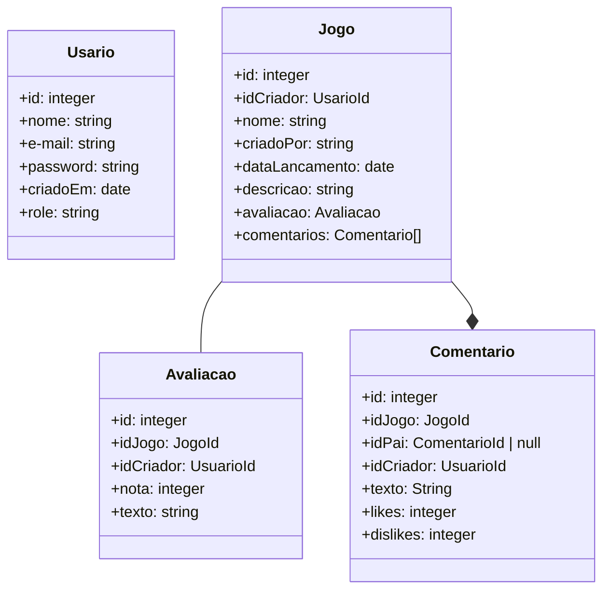

# Análise de Jogos

```mermaid
classDiagram

    class Usario {
  +id: integer
  +nome: string
  +e-mail: string
  +password: string
  +criadoEm: date
  +role: string
}

class Jogo {
  +id: integer
  +idCriador: UsarioId
  +nome: string
  +criadoPor: string
  +dataLancamento: date
  +descricao: string
  +avaliacao: Avaliacao
  +comentarios: Comentario[]
}

class Avaliacao {
  +id: integer
  +idJogo: JogoId
  +idCriador: UsuarioId
  +nota: integer
  +texto: string 
}

class Comentario {
  +id: integer
  +idJogo: JogoId
  +idPai: ComentarioId | null
  +idCriador: UsuarioId
  +texto: String
  +likes: integer
  +dislikes: integer
}


Jogo --  Avaliacao 
Jogo  --* Comentario
```
