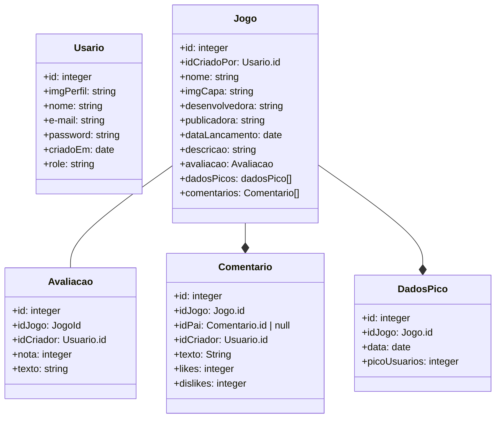

# Análise de Jogos

```mermaid
classDiagram

    class Usario {
  +id: integer
  +imgPerfil: string
  +nome: string
  +e-mail: string
  +password: string
  +criadoEm: date
  +role: string
}

class Jogo {
  +id: integer
  +idCriadoPor: Usario.id
  +nome: string
  +imgCapa: string
  +desenvolvedora: string
  +publicadora: string
  +dataLancamento: date
  +descricao: string
  +avaliacao: Avaliacao
  +dadosPicos: dadosPico[]
  +comentarios: Comentario[]
}

class Avaliacao {
  +id: integer
  +idJogo: JogoId
  +idCriador: Usuario.id
  +nota: integer
  +texto: string 
}

class Comentario {
  +id: integer
  +idJogo: Jogo.id
  +idPai: Comentario.id | null
  +idCriador: Usuario.id
  +texto: String
  +likes: integer
  +dislikes: integer
}

class DadosPico {
    +id: integer
    +idJogo: Jogo.id
    +data: date
    +picoUsuarios: integer
}


Jogo --  Avaliacao 
Jogo  --* Comentario
Jogo --* DadosPico
```
